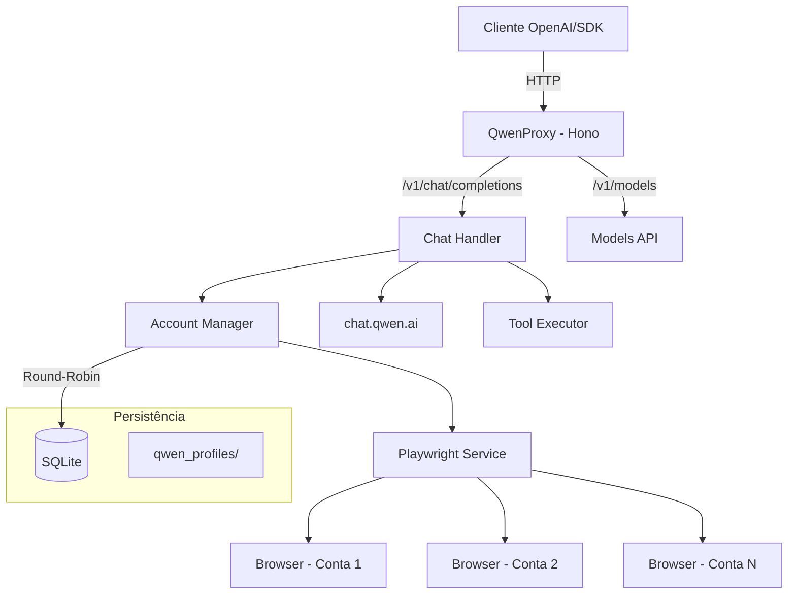

# QwenProxy

Proxy API local compatível com OpenAI que roteia requisições para os modelos do **Qwen (chat.qwen.ai)** via automação de navegador com Playwright. Suporte a múltiplas contas com rotação automática, execução de ferramentas, modo de pensamento (reasoning), persistência de sessão e armazenamento em SQLite.

[](https://github.com/pedrofariasx/qwenproxy/actions/workflows/ci.yml)
[](https://www.typescriptlang.org/)
[](https://hono.dev/)
[](https://playwright.dev/)
[](LICENSE)

---

## Features

- **OpenAI API Compatible** — Interface compatível com `/v1/chat/completions` e `/v1/models`.
- **Multi-Account** — Gerencie múltiplas contas Qwen com rotação round-robin e cooldown automático.
- **SQLite Storage** — Contas salvas em banco de dados SQLite (WAL mode) para performance e confiabilidade.
- **Reasoning Support** — Suporte completo ao modo de pensamento (thinking) dos modelos Qwen.
- **Tool Execution** — Sistema de execução de ferramentas locais integrado ao fluxo do chat.
- **Session Persistence** — Perfil de navegador persistente por conta em `qwen_profiles/`.
- **Auto-Login** — Login automático via credenciais com recuperação de sessão.
- **Browser Selection** — Escolha entre Chromium, Chrome, Firefox, Edge ou WebKit.
- **Monitoring** — Health check, métricas Prometheus e watchdog integrados.
- **Docker Ready** — Deploy para VPS com Docker, volumes persistentes e graceful shutdown.

---

## Arquitetura



---

## Pré-requisitos

| Dependência | Versão Mínima | Instalação |
|------------|--------------|-----------|
| Node.js | v20.x | [nvm](https://github.com/nvm-sh/nvm) |
| npm | v9.x | Incluído com Node.js |
| Playwright | - | `npx playwright install` |
| Docker (opcional) | v24.x | [Docker Docs](https://docs.docker.com/get-docker/) |

---

## Instalação

### Via npm

```bash
git clone https://github.com/pedrofariasx/qwenproxy.git
cd qwenproxy
npm install
npx playwright install
```

### Via Docker

```bash
docker-compose up -d
```

---

## Configuração

Crie o arquivo `.env` na raiz do projeto (veja `.env.example`):

```env
PORT=3000
HOST=0.0.0.0
NODE_ENV=development
API_KEY=
SSL_ENABLED=false
SSL_CERT_PATH=
SSL_KEY_PATH=

BROWSER_HEADLESS=true
BROWSER=chromium
QWEN_PROFILES_PATH=./qwen_profile
USER_AGENT=Mozilla/5.0 (X11; Linux x86_64) AppleWebKit/537.36 (KHTML, like Gecko) Chrome/120.0.0.0 Safari/537.36

CACHE_TTL=3600
RESPONSE_TTL=1800
CACHE_MAX_ENTRIES=10000
WATCHDOG_INTERVAL=5000
RATE_LIMIT_MAX=60
RATE_LIMIT_WINDOW_MS=60000
RATE_LIMIT_HEADER=x-forwarded-for
EXECUTOR_TIMEOUT_MS=120000
TOOL_TIMEOUT_MS=30000
TOOL_MAX_ARGUMENTS_BYTES=1048576
TOOL_MAX_RESULT_BYTES=524288

QWEN_BASE_URL=https://chat.qwen.ai
QWEN_HTTP_ENDPOINT=https://api.qwen.ai/v1/chat
QWEN_EMAIL=
QWEN_PASSWORD=
QWEN_ENCRYPTION_KEY=
```

### Variáveis principais

| Variável | Default | Observação |
|----------|---------|------------|
| `API_KEY` | vazio | Protege o proxy via `Authorization: Bearer ...`. |
| `BROWSER_HEADLESS` | `true` | Controla o modo headless do Playwright. |
| `BROWSER` | `chromium` | Seleciona o navegador usado no prewarm. |
| `QWEN_PROFILES_PATH` | `./qwen_profile` | Diretório do perfil persistente do navegador. |
| `CACHE_TTL` | `3600` | TTL do cache em segundos. |
| `WATCHDOG_INTERVAL` | `5000` | Intervalo do watchdog em ms. |
| `RATE_LIMIT_MAX` | `60` | Limite por janela para rate limiting. |
| `RATE_LIMIT_WINDOW_MS` | `60000` | Janela do rate limit em ms. |
| `RATE_LIMIT_HEADER` | `x-forwarded-for` | Cabeçalho usado para formar a chave do rate limit. |
| `EXECUTOR_TIMEOUT_MS` | `120000` | Timeout total do executor em ms. |
| `TOOL_TIMEOUT_MS` | `30000` | Timeout de uma execução individual de tool. |
| `TOOL_MAX_ARGUMENTS_BYTES` | `1048576` | Tamanho máximo dos argumentos serializados. |
| `TOOL_MAX_RESULT_BYTES` | `524288` | Tamanho máximo do resultado serializado. |

### Auth, sessão upstream e readiness

- **Auth do proxy**: `API_KEY` protege os endpoints `/v1/*` e `/metrics`. Se estiver vazio, o proxy aceita chamadas sem autenticação.
- **Sessão upstream Qwen**: é separada da auth do proxy. Ela vem das credenciais `QWEN_EMAIL` / `QWEN_PASSWORD` e do perfil persistente `QWEN_PROFILES_PATH`, gerenciada pelo Playwright.
- **Health de infraestrutura vs readiness funcional**:
  - `unknown` = o servidor já está no ar, mas ainda não concluiu a inicialização de cache/watchdog.
  - `degraded` = a infraestrutura subiu, porém a sessão upstream ainda não está pronta ou falhou parcialmente.
  - `ok` = cache, watchdog e pelo menos uma sessão upstream estão saudáveis.

### Startup e rotas

O servidor abre o listener HTTP/HTTPS primeiro e executa o prewarm do Playwright em background. Isso evita que o boot fique preso em sessão upstream lenta.

```bash
npm start                  # Chromium (padrão)
npm run start:chrome       # Google Chrome
npm run start:firefox      # Firefox
npm run start:edge         # Microsoft Edge
```

Rotas principais:

| Rota | Método | Descrição |
|------|--------|-----------|
| `/v1/chat/completions` | POST | Chat completions (streaming + non-streaming) |
| `/v1/chat/completions/stop` | POST | Abortar uma geração ativa |
| `/v1/models` | GET | Lista modelos usando uma sessão upstream disponível |
| `/v1/models/:model` | GET | Detalhes de um modelo específico |
| `/health` | GET | Health de infraestrutura e readiness funcional |
| `/metrics` | GET | Métricas no formato Prometheus |

Se não houver sessão upstream válida disponível, `/v1/models` responde de forma controlada com erro 503.

---

## Gerenciamento de Contas

As contas são armazenadas em SQLite (`data/qwenproxy.db`). Use o CLI interativo para gerenciar:

```bash
# Abrir o gerenciador de contas
npm run login

# Com navegador específico
npm run login:firefox
npm run login:chrome
npm run login:edge
```

O menu interativo permite:
- **[A]** Adicionar conta com credenciais (email + senha)
- **[M]** Adicionar conta via login manual no navegador
- **[R]** Remover uma conta
- **[L]** Login em todas as contas (inicializar sessões)

> Na primeira execução, se existir um `accounts.json` antigo, as contas serão migradas automaticamente para SQLite.

---

## Exemplos de Integração

### OpenAI SDK (Node.js)

```typescript
import OpenAI from 'openai';

const openai = new OpenAI({
  baseURL: 'http://localhost:3000/v1',
  apiKey: process.env.API_KEY || 'sk-no-key-required'
});

const completion = await openai.chat.completions.create({
  model: 'qwen-plus',
  messages: [{ role: 'user', content: 'Explique como funciona o Playwright.' }]
});

console.log(completion.choices[0].message.content);
```

### cURL

```bash
curl http://localhost:3000/v1/chat/completions \
  -H "Content-Type: application/json" \
  -H "Authorization: Bearer sua-chave" \
  -d '{
    "model": "qwen-plus",
    "messages": [{"role": "user", "content": "Hello!"}],
    "stream": true
  }'
```

---

## Deploy com Docker

### docker-compose.yml

```yaml
services:
  qwenproxy:
    build: .
    container_name: qwenproxy
    ports:
      - "${PORT:-3000}:3000"
    env_file:
      - .env
    volumes:
      - ./data:/app/data               # Banco SQLite
      - ./qwen_profiles:/app/qwen_profiles  # Sessões dos navegadores
    restart: unless-stopped
```

### Volumes persistentes

| Volume | Conteúdo |
|--------|----------|
| `./data` | Banco SQLite com as contas (`qwenproxy.db`) |
| `./qwen_profiles` | Perfis de navegador por conta (cookies, sessões) |

---

## Estrutura do Projeto

```
qwenproxy/
├── src/
│   ├── index.ts                 # Entry point
│   ├── login.ts                 # CLI de gerenciamento de contas
│   ├── api/
│   │   ├── server.ts            # Servidor Hono + startup
│   │   └── models.ts            # Endpoints /v1/models
│   ├── routes/
│   │   └── chat.ts              # Handler /v1/chat/completions
│   ├── services/
│   │   ├── playwright.ts        # Automação de navegador
│   │   └── qwen.ts              # Integração com API do Qwen
│   ├── core/
│   │   ├── accounts.ts          # CRUD de contas (SQLite)
│   │   ├── account-manager.ts   # Rotação round-robin + cooldowns
│   │   ├── database.ts          # Conexão e migrations SQLite
│   │   ├── config.ts            # Configuração com Zod
│   │   ├── logger.ts            # Logger estruturado
│   │   ├── metrics.ts           # Coleta de métricas
│   │   ├── model-registry.ts    # Registro de modelos e context windows
│   │   ├── stream-registry.ts   # Tracking de streams ativos
│   │   └── watchdog.ts          # Health monitoring
│   ├── cache/
│   │   └── memory-cache.ts      # Cache em memória com TTL
│   ├── tools/
│   │   ├── executor.ts          # Execução de ferramentas
│   │   ├── registry.ts          # Registro de tools
│   │   ├── parser.ts            # Parser de <tool_call> tags
│   │   ├── schema.ts            # Validação JSON Schema
│   │   └── types.ts             # Tipos do sistema de tools
│   ├── utils/
│   │   ├── json.ts              # Parser JSON robusto
│   │   ├── context-truncation.ts # Truncamento de contexto
│   │   └── types.ts             # Re-exports de tipos
│   └── types/
│       └── openai.ts            # Tipos compatíveis com OpenAI
├── data/                        # Banco SQLite (gitignored)
├── qwen_profiles/               # Perfis de navegador por conta (gitignored)
├── Dockerfile
├── docker-compose.yml
└── package.json
```

---

## Troubleshooting

| Problema | Solução |
|----------|---------|
| Porta em uso | Altere `PORT` no `.env` ou encerre o processo na porta 3000 |
| Navegador não abre | Execute `npx playwright install` |
| Sessão expirada | Execute `npm run login` para renovar cookies |
| Rate limit em todas as contas | Adicione mais contas via `npm run login` |
| Banco corrompido | Apague `data/qwenproxy.db` e re-adicione as contas |

---

## Seguranca

Auditorias de dependencias sao executadas automaticamente via GitHub Actions em toda pull request que altere `package.json` ou `package-lock.json`, e semanalmente as segundas-feiras as 06:00.

Para executar a auditoria manualmente:

```bash
npm run audit
```

Isso executa `npm audit` com nivel minimo `high`, reportando vulnerabilidades criticas e altas.

---

## Disclaimer

> Este projeto é fornecido estritamente para fins educacionais e de pesquisa.

Os autores não incentivam ou endossam:
- Violação dos Termos de Serviço da plataforma Qwen.
- Automação não autorizada em larga escala.
- Uso para atividades maliciosas.

**Use por sua conta e risco.**
