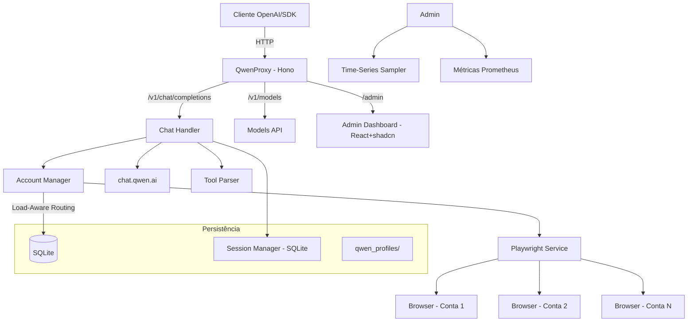

<p align="center">
  
</p>

Proxy API local compatível com OpenAI que roteia requisições para os modelos do **Qwen (chat.qwen.ai)** via automação de navegador com Playwright. Suporte a múltiplas contas com **roteamento por carga (load-aware)**, **dashboard de administração** (React + shadcn/ui), **API keys multiusuário** com cotas, sessões híbridas persistentes, execução de ferramentas, modo de pensamento (reasoning) e armazenamento em SQLite.

[](https://github.com/pedrofariasx/qwenproxy/actions/workflows/ci.yml)
[](https://www.typescriptlang.org/)
[](https://hono.dev/)
[](https://playwright.dev/)
[](LICENSE)
<a href="https://www.buymeacoffee.com/pedrofariasx" target="_blank"></a>

---

## Features

- **OpenAI API Compatible** — Interface compatível com `/v1/chat/completions`, `/v1/models` e `/v1/upload`.
- **Multi-Account** — Múltiplas contas Qwen com **roteamento por carga** (load-aware scheduling), cooldown automático e warm pool de chats.
- **Admin Dashboard** — Painel de administração completo em `/admin` (React + shadcn/ui) com gráficos em tempo real via SSE.
- **Multi-User** — API keys por usuário com rate limit (RPM) e teto de concorrência.
- **Hybrid Sessions** — Sessões de conversa persistentes (SQLite) com envio econômico, verificação de histórico e guard contra respostas degeneradas ("Yes").
- **Guest Mode** — Modo convidado sem necessidade de login, usando a API pública do Qwen.
- **SQLite Storage** — Contas, usuários e sessões em banco SQLite (WAL mode).
- **Reasoning Support** — Suporte completo ao modo de pensamento (thinking) dos modelos Qwen.
- **Multimodal Upload** — Envio de imagens, vídeos, áudios e documentos via `/v1/upload` com integração ao OSS do Qwen (texto embutido no prompt).
- **Tool Execution** — Sistema de execução de ferramentas locais integrado ao fluxo do chat.
- **Session Persistence** — Perfil de navegador persistente por conta em `qwen_profiles/`.
- **Auto-Login** — Login automático via credenciais com recuperação de sessão.
- **Browser Selection** — Escolha entre Chromium, Chrome, Firefox, Edge ou WebKit.
- **Monitoring** — Health check, métricas Prometheus, watchdog e séries temporais (amostras a cada 5s, janela de 20min).
- **CLI Binary** — Instale globalmente via npm e use o comando `qwenproxy` diretamente.
- **Docker Ready** — Deploy para VPS com Docker, volumes persistentes e graceful shutdown.

---

## Arquitetura


```mermaid
graph TD
    Client[Cliente OpenAI/SDK] -->|HTTP| Proxy[QwenProxy - Hono]
    Proxy -->|/v1/chat/completions| Handler[Chat Handler]
    Proxy -->|/v1/models| Models[Models API]
    Proxy -->|/admin| Dashboard[Admin Dashboard - React+shadcn]
    Handler --> AccountMgr[Account Manager]
    AccountMgr -->|Load-Aware Routing| Accounts[(SQLite)]
    AccountMgr --> Playwright[Playwright Service]
    Playwright --> Browser1[Browser - Conta 1]
    Playwright --> Browser2[Browser - Conta 2]
    Playwright --> BrowserN[Browser - Conta N]
    Handler --> QwenAPI[chat.qwen.ai]
    Handler --> Tools[Tool Parser]
    Handler --> Sessions[Session Manager - SQLite]
    Admin --> TimeSeries[Time-Series Sampler]
    Admin --> MetricsSvc[Métricas Prometheus]

    subgraph "Persistência"
        Accounts
        Profiles[qwen_profiles/]
        Sessions
    end
```

---

## Pré-requisitos

| Dependência       | Versão Mínima | Instalação                                         |
| ----------------- | ------------- | -------------------------------------------------- |
| Node.js           | v20.x         | [nvm](https://github.com/nvm-sh/nvm)               |
| npm               | v9.x          | Incluído com Node.js                               |
| Playwright        | -             | `npx playwright install`                           |
| Docker (opcional) | v24.x         | [Docker Docs](https://docs.docker.com/get-docker/) |

---

## Instalação

### Via npm (Global)

```bash
npm install -g @pedrofariasx/qwenproxy
npx playwright install
qwenproxy
```

### Via npm (Local)

```bash
git clone https://github.com/pedrofariasx/qwenproxy.git
cd qwenproxy
npm install
npx playwright install
```

### Via Docker

```bash
docker-compose up -d
```

---

## Configuração

Crie o arquivo `.env` na raiz do projeto (veja `.env.example`):

```env
# Porta do servidor (default: 3000)
PORT=3000

# Host do servidor (default: 0.0.0.0)
HOST=0.0.0.0

# Chave de API para proteger os endpoints (opcional)
API_KEY=sua-chave-secreta-aqui

# Credenciais Qwen para login automático (modo single-account)
QWEN_EMAIL=seu-email@exemplo.com
QWEN_PASSWORD=sua-senha-aqui

# Modo convidado - sem login, usa API pública (default: false)
QWEN_GUEST_MODE_ONLY=false

# Navegador (chromium, firefox, chrome, edge, webkit)
BROWSER=chromium

# Executar navegador sem interface gráfica (default: true)
HEADLESS=true

# Timeouts (milissegundos)
NAVIGATION_TIMEOUT=90000
PAGE_TIMEOUT=60000
HTTP_TIMEOUT=45000
HEADERS_TIMEOUT=90000
CHAT_TIMEOUT=120000
STREAM_IDLE_TIMEOUT=180000
```

---

## Gerenciamento de Contas

As contas são armazenadas em SQLite (`data/qwenproxy.db`). Use o CLI interativo para gerenciar:

```bash
# Abrir o gerenciador de contas
npm run login

# Com navegador específico
npm run login:firefox
npm run login:chrome
npm run login:edge
```

O menu interativo permite:

- **[A]** Adicionar conta com credenciais (email + senha)
- **[M]** Adicionar conta via login manual no navegador
- **[R]** Remover uma conta
- **[L]** Login em todas as contas (inicializar sessões)

> Na primeira execução, se existir um `accounts.json` antigo, as contas serão migradas automaticamente para SQLite.

---

## Uso

### Iniciar o servidor

```bash
npm start                  # Chromium (padrão)
npm run start:chrome       # Google Chrome
npm run start:firefox      # Firefox
npm run start:edge         # Microsoft Edge
```

O servidor inicia em `http://localhost:3000` com as seguintes rotas:

| Rota                        | Método | Descrição                                                            |
| --------------------------- | ------ | -------------------------------------------------------------------- |
| `/v1/chat/completions`      | POST   | Chat completions (streaming + non-streaming)                         |
| `/v1/chat/completions/stop` | POST   | Abortar uma geração ativa                                            |
| `/v1/models`                | GET    | Listar modelos disponíveis                                           |
| `/v1/models/:model`         | GET    | Informações de um modelo específico                                  |
| `/v1/upload`                | POST   | Upload de arquivos multimodais (imagens, vídeos, áudios, documentos) |
| `/admin`                    | GET    | Dashboard de administração (React + shadcn/ui)                       |
| `/health`                   | GET    | Health check com status do sistema                                   |
| `/metrics`                  | GET    | Métricas no formato Prometheus                                       |

---

## Exemplos de Integração

### OpenAI SDK (Node.js)

```typescript
import OpenAI from "openai";

const openai = new OpenAI({
  baseURL: "http://localhost:3000/v1",
  apiKey: process.env.API_KEY || "sk-no-key-required",
});

const completion = await openai.chat.completions.create({
  model: "qwen-plus",
  messages: [{ role: "user", content: "Explique como funciona o Playwright." }],
});

console.log(completion.choices[0].message.content);
```

### cURL

```bash
curl http://localhost:3000/v1/chat/completions \
  -H "Content-Type: application/json" \
  -H "Authorization: Bearer sua-chave" \
  -d '{
    "model": "qwen-plus",
    "messages": [{"role": "user", "content": "Hello!"}],
    "stream": true
  }'
```

## Sessões híbridas (economia de contexto) e upload de arquivos .txt

Para conversas longas o proxy usa a **estrutura híbrida**: a primeira mensagem de
uma conversa envia o histórico completo (bootstrap); a partir daí, apenas o
`system` + a última mensagem do usuário são enviados, aproveitando o histórico
que o Qwen mantém do lado do servidor para o mesmo `chat_id` (com threading via
`parent_id`).

Para ativar, informe a mesma chave de sessão em todas as mensagens da conversa,
usando o campo OpenAI `user` (ou o header `x-qwen-session`):

```typescript
const completion = await openai.chat.completions.create({
  model: "qwen-plus",
  user: "minha-conversa-123",
  messages: [
    /* histórico completo da conversa */
  ],
});

// A resposta expõe `session_id` (o chat_id no Qwen). Você pode continuar a
// conversa passando esse valor de volta no campo `user`.
console.log(completion.session_id);
```

- **Turno 1** de uma sessão: `parent_id = null`, histórico completo enviado.
- **Turnos seguintes**: apenas `User: <última mensagem>` com `parent_id` apontando
  para a última resposta, o que reduz drasticamente os tokens enviados.
- Sem chave de sessão o proxy mantém o comportamento original (envia o histórico
  completo, mas ainda encadeia as mensagens com `parent_id`).
- Quando a conversa envolve `tools` ou multimodal, o modo econômico é desativado
  automaticamente e o histórico completo é sempre enviado.

**Arquivos de texto (.txt/.md/.csv/...)** enviados pelo usuário ou prompts
grandes são **embutidos no texto da mensagem** (para o modelo sempre ver o
conteúdo) com uma diretiva explícita de resposta completa. Respostas degeneradas
(apenas "Yes", "Ok", "Sim") são detectadas e, no modo não-streaming, a requisição
é refeita uma vez com uma diretiva corretiva — nunca são entregues como resposta
final.

Configuração (`.env`):

```
HYBRID_SESSIONS_ENABLED=true
HYBRID_SESSION_VERIFY=true   # verifica histórico no servidor antes de reusar; divergência → re-bootstrap
HYBRID_SESSION_TTL_MS=86400000
```

## Dashboard de administração

Acesse `http://localhost:3000/admin` para gerenciar o projeto em uma única tela
— frontend **React 19 + shadcn/ui** (pasta `web/`, Vite + Tailwind v4), servido
diretamente pelo proxy.

O que você encontra:

- **Visão geral** — KPIs (requisições, erros, latência, streams, sessões e
  **memória RSS%** do sistema) + **gráficos em tempo real** por tipo de dado:
  requisições/min e erros em **barras**, latência em **linha**, streams/memória/
  sessões em **área**. Os dados chegam por **Server-Sent Events** (uma única
  conexão, push a cada 3s), com amostras de 5s e janela de 20min; se o stream
  cair, há fallback automático para polling de 4s.
- **Contas** — adicionar/remover contas Qwen, limpar cooldown, forçar refresh
  de headers e ver a carga atual de cada conta (barras de progresso).
- **API Keys** — multiusuário: criar/editar/remover usuários, regenerar chaves e
  ajustar **RPM** e **concorrência** por usuário.
- **Configuração** — editar as variáveis essenciais do `.env` (com validação e
  allowlist), baixar métricas em Prometheus e reiniciar o servidor.
- **Métricas** — saída Prometheus completa de `/metrics`, agrupada por métrica,
  com filtro de busca e botão de copiar.

<p align="center">
  
</p>

**Build do frontend** (necessário quando a pasta `web/dist` não existir; o servidor
usa um painel inline simples como fallback):

```bash
npm --prefix web install
npm --prefix web run build   # ou a partir da raiz: npm run build:admin
```

Autenticação: defina `ADMIN_PASSWORD` no `.env` (ou deixe em branco para usar a
`API_KEY`). A sessão usa cookie HttpOnly assinado (7 dias).

```
ADMIN_PASSWORD=
```

---

## Multi-Usuário (API Keys com cotas)

Quando exposto para vários usuários, cada um recebe a própria API key com
**rate limit** (requisições por minuto) e **teto de concorrência** (streams
simultâneos). As chaves ficam na tabela `users` do SQLite e podem ser criadas
pela dashboard em `/admin` ou via `USER_API_KEYS` no `.env`:

```env
USER_RATE_LIMIT_RPM=120        # padrão por usuário
USER_MAX_CONCURRENCY=8         # máximo de streams simultâneos por usuário
USER_API_KEYS=sk-key-1:usuario1,sk-key-2:usuario2
```

Os clientes autenticam com `Authorization: Bearer <chave>`. A `API_KEY` global
continua valendo como usuário `global` (sem distinção de cota). Um usuário que
estoura o limite recebe `429` com a mensagem correspondente.

---

## Deploy em 1 clique

> ⚠️ O proxy precisa de **navegador (Docker)** e **armazenamento persistente** (SQLite de sessões + perfis de conta). Não funciona em serverless (Vercel/Netlify/Cloud Run sem container).

| Provedor | Botão | Observações |
| --- | --- | --- |
| **Render** (recomendado) | [](https://render.com/deploy?repo=https://github.com/pedrofariasx/qwenproxy) | Docker + disk persistente (1GB) configurados via `render.yaml`. Plano free com sleep — acorde via healthcheck. |
| **Railway** | [](https://railway.app/new?template=https://github.com/pedrofariasx/qwenproxy) | Detecta o `Dockerfile` automaticamente. **Crie um Volume** e monte em `/app/data` (perfis em `USER_DATA_DIR=/app/data/qwen_profiles`) para não perder sessões. |

### Passos comuns após o deploy

1. Abra `/admin` (auth por `ADMIN_PASSWORD` ou `API_KEY`).
2. Adicione suas contas Qwen na aba **Contas** (ou defina `SINGLE_ACCOUNT_MODE` + `SINGLE_ACCOUNT_ID/EMAIL` no painel).
3. Defina as env vars sensíveis no painel do provedor: `API_KEY`, `ADMIN_PASSWORD`, `QWEN_EMAIL`, `QWEN_PASSWORD`.

---

## Deploy com Docker

### docker-compose.yml

```yaml
services:
  qwenproxy:
    build: .
    container_name: qwenproxy
    ports:
      - "${PORT:-3000}:${PORT:-3000}"
    env_file:
      - path: .env
        required: false
    volumes:
      - qwenproxy_data:/app/data
      - qwenproxy_profiles:/app/qwen_profiles
    restart: unless-stopped
    shm_size: '1gb'
    logging:
      driver: "json-file"
      options:
        max-size: "10m"
        max-file: "3"

volumes:
  qwenproxy_data:
  qwenproxy_profiles:
```

### Volumes persistentes

| Volume               | Conteúdo                                                             |
| -------------------- | -------------------------------------------------------------------- |
| `qwenproxy_data`     | Banco SQLite: contas, usuários (API keys) e sessões (`qwenproxy.db`) |
| `qwenproxy_profiles` | Perfis de navegador por conta (cookies, sessões)                     |

O container ajusta automaticamente as permissões desses volumes no startup. Se usar bind mounts locais em vez dos volumes nomeados acima, garanta que os diretórios montados sejam graváveis pelo container.

---

## Estrutura do Projeto

```
qwenproxy/
├── bin/
│   └── qwenproxy.mjs            # Entry point do CLI binário
├── src/
│   ├── index.ts                 # Entry point do servidor
│   ├── login.ts                 # CLI de gerenciamento de contas
│   ├── api/
│   │   ├── admin.ts             # Backend do dashboard admin (+ SSE /api/live)
│   │   ├── admin-dashboard.ts   # Dashboard inline de fallback (HTML)
│   │   ├── models.ts            # Endpoints /v1/models
│   │   └── server.ts            # Servidor Hono + startup + autenticação
│   ├── cache/
│   │   └── memory-cache.ts      # Cache em memória com TTL
│   ├── core/
│   │   ├── account-manager.ts   # Roteamento load-aware + cooldowns + draining
│   │   ├── account-lanes.ts     # Lanes de conta (single-account mode)
│   │   ├── accounts.ts          # CRUD de contas (SQLite)
│   │   ├── config.ts            # Configuração com Zod
│   │   ├── crypto-utils.ts      # Criptografia de senhas em repouso
│   │   ├── database.ts          # Conexão, migrations (contas/users/sessions)
│   │   ├── env-settings.ts      # Leitura/escrita segura do .env (admin)
│   │   ├── logger.ts            # Logger estruturado
│   │   ├── metrics.ts           # Coleta de métricas Prometheus (memória RSS)
│   │   ├── model-registry.ts    # Registro de modelos e context windows
│   │   ├── stream-registry.ts   # Tracking de streams ativos
│   │   ├── time-series.ts       # Amostrador de séries temporais (gráficos)
│   │   ├── user-manager.ts      # Identidade multiusuário + cotas
│   │   └── watchdog.ts          # Health monitoring (RAM via RSS)
│   ├── routes/
│   │   ├── chat.ts              # Handler /v1/chat/completions
│   │   ├── sse-parser.ts        # Parser incremental de SSE + delta
│   │   ├── stream-handler.ts    # Streaming SSE + guard degenerado
│   │   ├── tool-handler.ts      # Execução de tools locais
│   │   └── upload.ts            # Upload multimodais + docs de texto inline
│   ├── services/
│   │   ├── browser-manager.ts   # Ciclo de vida de browsers/contexts
│   │   ├── error-handler.ts     # Tipagem e retry de erros Qwen
│   │   ├── header-interceptor.ts # Captura de cookies/headers via CDP
│   │   ├── playwright.ts        # Fachada do serviço Playwright
│   │   ├── qwen.ts              # Integração com API do Qwen
│   │   ├── session-manager.ts   # Sessões híbridas persistentes (SQLite)
│   │   ├── stealth.ts           # Script anti-detecção
│   │   ├── stream-bridge.ts     # Ponte de stream browser → Node
│   │   ├── stream-creator.ts    # Criação de chats e streams Qwen
│   │   └── warm-pool.ts         # Pool de chats pré-aquecidos
│   ├── tests/                   # Testes automatizados (node:test)
│   ├── tools/
│   │   ├── parser.ts            # Parser de <tool_call> tags
│   │   ├── registry.ts          # Registro de tools
│   │   ├── schema.ts            # Validação JSON Schema
│   │   └── types.ts             # Tipos do sistema de tools
│   └── utils/
│       ├── context-truncation.ts # Truncamento de contexto
│       ├── degenerate-answer.ts  # Detecção de respostas degeneradas ("Yes")
│       ├── json.ts              # Parser JSON robusto
│       ├── qwen-stream-parser.ts # Parser de streams SSE do Qwen
│       └── types.ts             # Re-exports de tipos
├── web/                         # Dashboard admin (React + shadcn/ui)
│   ├── src/
│   │   ├── App.tsx              # Shell (sidebar, navegação, login)
│   │   ├── components/          # UI (shadcn) + charts (recharts)
│   │   ├── hooks/use-live.ts    # Cliente SSE com fallback para polling
│   │   ├── pages/               # Visão geral, Contas, API Keys, Config, Métricas
│   │   └── lib/                 # Cliente da API admin
│   ├── public/                  # Logo e favicon
│   ├── index.html
│   └── package.json
├── data/                        # Banco SQLite (gitignored)
├── qwen_profiles/               # Perfis de navegador por conta (gitignored)
├── Dockerfile
├── docker-compose.yml
├── tsconfig.json
├── tsconfig.build.json
└── package.json
```

---

## Troubleshooting

| Problema                         | Solução                                                     |
| -------------------------------- | ----------------------------------------------------------- |
| Porta em uso                     | Altere `PORT` no `.env` ou encerre o processo na porta 3000 |
| Navegador não abre               | Execute `npx playwright install`                            |
| Sessão expirada                  | Execute `npm run login` para renovar cookies                |
| Rate limit em todas as contas    | Adicione mais contas via `npm run login`                    |
| Banco corrompido                 | Apague `data/qwenproxy.db` e re-adicione as contas          |
| Dashboard mostra fallback inline | Rode `npm run build:admin` para gerar a UI React            |

---

## Disclaimer

> Este projeto é fornecido estritamente para fins educacionais e de pesquisa.

Os autores não incentivam ou endossam:

- Violação dos Termos de Serviço da plataforma Qwen.
- Automação não autorizada em larga escala.
- Uso para atividades maliciosas.

**Use por sua conta e risco.**

## Star History

<a href="https://www.star-history.com/?repos=pedrofariasx%2Fqwenproxy&type=timeline&legend=bottom-right">
 <picture>
   <source media="(prefers-color-scheme: dark)" srcset="https://api.star-history.com/chart?repos=pedrofariasx/qwenproxy&type=date&theme=dark&legend=bottom-right" />
   <source media="(prefers-color-scheme: light)" srcset="https://api.star-history.com/chart?repos=pedrofariasx/qwenproxy&type=date&legend=bottom-right" />
   
 </picture>
</a>
